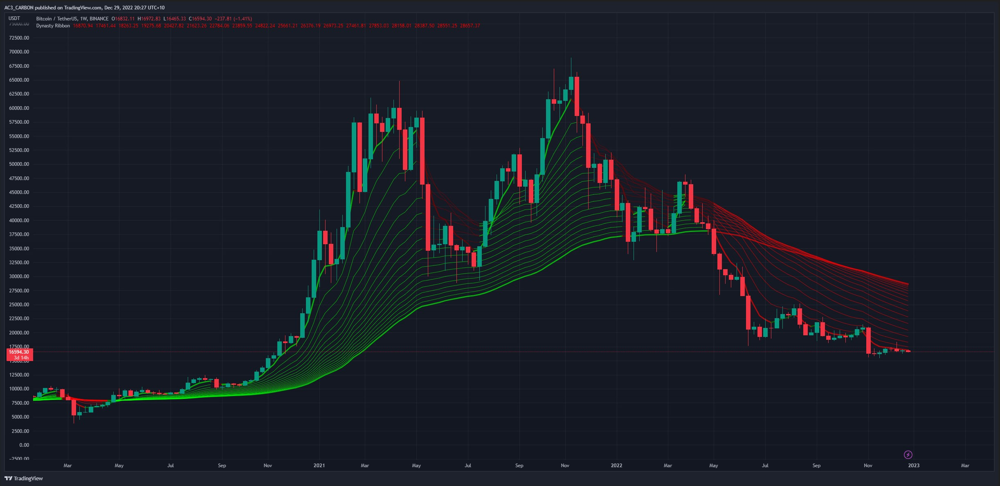

<h1 align="center">Custom Indicator via PineScript ( TradingView) </h1> 
<h3 align="center">Trending Market Bias / Dynasty Ribbon </h3> 

  

---

- This Custom Indicator was designed to provide a non-biased outlook on any financial market by combining multiple EMAs (expodential moving average). 
- When multiple emas cross, the ribbon changes colour depending on the direction of the market, Red - Bearish, Green - Bullish. 
- Most traders overlook market direction and, at times, require a clearer picture of where the market is headed. 

This is a personal indicator that I continue to use on a daily basis to provide me with an overall outlook on any potential trades/plays in the financial markets.
 

Example Below : BTC / TETHERUS - Bitcoin - Live Chart
 

---

 

---
### BTC / TETHERUS - BINANCE - Bitcoin- Weekly Timeframe :
 

---
### BTC / TETHERUS - BINANCE - Bitcoin- Daily Timeframe :

 

---
### BTC / TETHERUS - BINANCE - Bitcoin- 4Hr Timeframe :

 

---

<h1 align="center>License : </h1>

Use it freely but please do not republish, distribute or sell "as-is". 
This is NOT Financial Advice, and results may vary when trading.

<h3 align="center">Connect with me:</h3>

---
